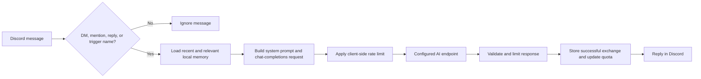

# Disturpe AI Chatbot

Disturpe AI Chatbot is a self-hosted Discord conversation bot with provider-neutral AI configuration, local SQLite memory, configurable daily quotas, optional Discord logging, and privacy-focused defaults.

The project does not depend on a specific AI vendor. You choose the complete API endpoint, model name, authentication method, request limits, and attachment behavior through environment variables. The selected endpoint must accept the OpenAI-compatible chat-completions request format.

> [!IMPORTANT]
> Self-hosting does not make AI requests private by itself. User messages, selected conversation history, the system prompt, and enabled attachment URLs are sent to the AI endpoint configured by the operator. Review that provider's privacy and retention policies before inviting users.

## Table of contents

- [Highlights](#highlights)
- [How it works](#how-it-works)
- [Requirements](#requirements)
- [Discord application setup](#discord-application-setup)
- [Installation](#installation)
- [Configuration](#configuration)
- [AI endpoint examples](#ai-endpoint-examples)
- [Running the bot](#running-the-bot)
- [When the bot responds](#when-the-bot-responds)
- [Commands](#commands)
- [Memory and quotas](#memory-and-quotas)
- [Attachments](#attachments)
- [Logging](#logging)
- [Privacy and security](#privacy-and-security)
- [Customizing the personality](#customizing-the-personality)
- [Project structure](#project-structure)
- [Development and testing](#development-and-testing)
- [Troubleshooting](#troubleshooting)
- [Known limitations](#known-limitations)
- [Security reports and license](#security-reports-and-license)

## Highlights

- **Provider-neutral configuration:** choose any OpenAI-compatible chat-completions endpoint and model.
- **Flexible authentication:** use Bearer tokens, custom API-key headers, no authentication for local services, or additional provider headers.
- **Local conversation memory:** store messages in a single SQLite database with FTS5/BM25 retrieval when available.
- **Automatic retention:** delete old conversation messages after 30 days by default.
- **Daily quotas:** limit successful conversations per Discord user and reset quotas at midnight in a configurable time zone.
- **Privacy-focused logging:** keep message and response bodies out of Discord log cards by default.
- **Secure API behavior:** reject remote plaintext HTTP by default, disable redirects, cap response size, and avoid logging provider response bodies.
- **Attachment controls:** independently decide whether image URLs and non-image file URLs are sent to the AI provider.
- **Administrative controls:** restrict memory inspection, analysis, export, deletion, and quota reset commands to one Discord user ID.
- **Cross-platform scripts:** use the included Linux and Windows installation/start scripts.

## How it works



For each accepted message, the bot:

1. Checks whether the message should trigger a response.
2. Verifies the user's remaining daily quota.
3. Loads up to 24 recent messages from the current Discord channel conversation.
4. Retrieves up to six older relevant messages from the same user's memory.
5. Builds the system prompt using the configured personality and time zone.
6. Sends an OpenAI-compatible request to the configured AI endpoint.
7. Stores the successful user/assistant exchange locally.
8. Sends the response to Discord, splitting long responses safely when necessary.

Failed API requests do not consume quota.

## Requirements

- Python 3.12 or newer
- A Discord application with a bot user
- A Discord bot token
- **Message Content Intent** enabled for the bot
- An AI endpoint that accepts OpenAI-compatible chat-completions requests
- SQLite with FTS5 support for ranked full-text retrieval
  - If FTS5 is unavailable, the application automatically uses a simpler SQLite text search.

No Docker configuration is included. The provided scripts use a project-local Python virtual environment at `.venv/`.

## Discord application setup

1. Open the [Discord Developer Portal](https://discord.com/developers/applications).
2. Create a new application or select an existing one.
3. Open the **Bot** page and create a bot user if needed.
4. Generate or reset the bot token and store it only in your local `.env` file.
5. Under **Privileged Gateway Intents**, enable **Message Content Intent**.
6. Open **OAuth2 > URL Generator**.
7. Select the `bot` scope.
8. Grant the permissions required by your deployment. The normal minimum is:
   - View Channels
   - Send Messages
   - Read Message History
   - Attach Files, if administrator exports will be used
9. Use the generated URL to invite the bot to your server.

To copy Discord user and channel IDs:

1. Open Discord **User Settings > Advanced**.
2. Enable **Developer Mode**.
3. Right-click a user or channel and select **Copy ID**.

## Installation

### 1. Create the local configuration

Linux or macOS-style shell:

```bash
cp .env.example .env
```

Windows Command Prompt:

```bat
copy .env.example .env
```

Open `.env` and configure at least:

```dotenv
DISCORD_TOKEN=your-discord-bot-token
AI_API_URL=https://api.example.com/v1/chat/completions
AI_MODEL=your-model-name
AI_API_KEY=your-provider-api-key
```

Never commit `.env`.

### 2. Install dependencies

Linux:

```bash
chmod +x install.sh start.sh stop.sh
./install.sh
```

Windows:

```text
scripts\windows\install.bat
```

The installation scripts:

- Create `.venv/` if it does not exist.
- Upgrade `pip`, `setuptools`, and `wheel` inside that virtual environment.
- Install the pinned runtime dependencies from `requirements.txt`.
- Verify imports and SQLite FTS5 support.

Do not install the requirements globally with administrator or root privileges.

## Configuration

All configuration is read from `.env` at startup. Restart the bot after changing environment variables. Boolean values accept `true`, `false`, `1`, `0`, `yes`, `no`, `on`, and `off`.

### Discord settings

| Variable | Required | Default | Description |
| --- | --- | --- | --- |
| `DISCORD_TOKEN` | Yes | Empty | Discord bot token. Keep it secret. |
| `AUTHORIZED_USER_ID` | No | `0` | Discord user ID allowed to run administrator commands. `0` disables administrator access. |
| `MESSAGE_LOG_CHANNEL_ID` | No | `0` | Channel receiving conversation log cards. `0` disables these logs. |
| `BOT_LOG_CHANNEL_ID` | No | `0` | Channel receiving operational and guild join/remove logs. `0` disables these logs. |
| `LOG_MESSAGE_CONTENT` | No | `false` | Include user and assistant message bodies in conversation log cards. Keep disabled unless users have been informed. |
| `BOT_TRIGGER_NAMES` | No | `Disturpe,Disturpe AI,Disturpe AI Chatbot` | Comma-separated standalone names that trigger the bot in guild messages. |
| `BOT_TIMEZONE` | No | `UTC` | IANA time-zone name used for logs, quota resets, and time context in the prompt. Example: `America/New_York`. |

### AI endpoint settings

| Variable | Required | Default | Description |
| --- | --- | --- | --- |
| `AI_API_URL` | Yes | Empty | Full chat-completions endpoint URL, including its path. |
| `AI_MODEL` | Yes | Empty | Model identifier sent in the request body. |
| `AI_API_KEY` | No | Empty | Provider credential. May remain empty for unauthenticated local endpoints. |
| `AI_API_KEY_HEADER` | No | `Authorization` | Header used for `AI_API_KEY`. |
| `AI_API_KEY_PREFIX` | No | `Bearer` | Text placed before the API key. Use an empty value for a raw key. |
| `AI_EXTRA_HEADERS_JSON` | No | `{}` | Additional string headers encoded as a JSON object. |
| `AI_ALLOW_INSECURE_HTTP` | No | `false` | Permit remote plaintext HTTP. Localhost HTTP is allowed without enabling this option. |
| `AI_CONNECT_TIMEOUT` | No | `10` | Connection timeout in seconds. Minimum effective value: `0.1`. |
| `AI_READ_TIMEOUT` | No | `60` | Response read timeout in seconds. Minimum effective value: `0.1`. |
| `AI_MAX_RETRIES` | No | `3` | Maximum request attempts. Minimum effective value: `1`. |
| `AI_MAX_RESPONSE_BYTES` | No | `2000000` | Maximum accepted JSON response size. Minimum effective value: `1024`. |
| `AI_REQUESTS_PER_MINUTE` | No | `60` | Client-side request limit. Set to `0` to disable the limiter. |
| `AI_SEND_IMAGE_URLS` | No | `true` | Send Discord image attachment URLs using OpenAI-compatible image content blocks. |
| `AI_SEND_FILE_URLS` | No | `false` | Append non-image attachment URLs to the user prompt. |

The client does not follow HTTP redirects. Retryable responses include HTTP `408`, `429`, and `5xx`. Provider error bodies are not copied into user-visible errors or operational logs.

`AI_EXTRA_HEADERS_JSON` may contain only string keys and values. It cannot override standard protected headers such as `Content-Type`, `Accept`, `User-Agent`, `Host`, `Content-Length`, or `Transfer-Encoding`. When `AI_API_KEY` is set, it also cannot override the configured authentication header.

### Memory and usage settings

| Variable | Required | Default | Description |
| --- | --- | --- | --- |
| `MESSAGE_QUOTA` | No | `1000` | Successful conversations allowed per user per day. Minimum effective value: `1`. |
| `MEMORY_RETENTION_DAYS` | No | `30` | Delete messages older than this many days. `0` disables automatic retention cleanup. |
| `DATA_DIR` | No | `data` | Directory containing runtime data such as `memory.db` and `bot.pid`. Relative paths are resolved from the project directory. |
| `PERSONALITY_FILE` | No | `config/personality.md` | Custom system-prompt personality file. Relative paths are resolved from the project directory. |

## AI endpoint examples

These examples demonstrate configuration patterns. Replace the example URLs, model names, and credentials with values from your chosen service.

### Standard Bearer-token endpoint

```dotenv
AI_API_URL=https://api.example.com/v1/chat/completions
AI_MODEL=example-chat-model
AI_API_KEY=replace-me
AI_API_KEY_HEADER=Authorization
AI_API_KEY_PREFIX=Bearer
AI_EXTRA_HEADERS_JSON={}
```

The resulting authentication header is:

```http
Authorization: Bearer replace-me
```

### Raw API-key header

```dotenv
AI_API_URL=https://gateway.example.com/v1/chat/completions
AI_MODEL=example-model
AI_API_KEY=replace-me
AI_API_KEY_HEADER=x-api-key
AI_API_KEY_PREFIX=
```

The resulting authentication header is:

```http
x-api-key: replace-me
```

### Local OpenAI-compatible server

```dotenv
AI_API_URL=http://127.0.0.1:11434/v1/chat/completions
AI_MODEL=local-model-name
AI_API_KEY=
AI_REQUESTS_PER_MINUTE=0
```

Plain HTTP is accepted automatically only for `localhost`, `127.0.0.1`, and `::1`. Use HTTPS for remote endpoints.

### Additional provider headers

```dotenv
AI_EXTRA_HEADERS_JSON={"X-Application":"Disturpe AI Chatbot","X-Environment":"production"}
```

The value must be valid JSON on one line.

## Running the bot

### Linux

Start the bot in the foreground:

```bash
./start.sh
```

Stop it from another terminal:

```bash
./stop.sh
```

`start.sh` writes the running process ID to `data/bot.pid`. `stop.sh` verifies both the process working directory and command before terminating it, reducing the risk of stopping an unrelated process.

You can also run the module directly:

```bash
.venv/bin/python -m app
```

### Windows

Run:

```text
scripts\windows\start.bat
```

The bot runs in the foreground. Close it with `Ctrl+C` or close the terminal window.

## When the bot responds

The bot ignores messages authored by bots. For human-authored messages:

- **Direct messages:** always eligible for a response.
- **Guild messages:** eligible when at least one condition is true:
  - The bot is mentioned.
  - The message replies directly to one of the bot's messages.
  - The message contains a standalone name from `BOT_TRIGGER_NAMES`.

Trigger-name matching is case-insensitive and respects word boundaries. For example, `Disturpe` matches `DISTURPE!` but does not match `disturped`.

Up to ten Discord attachments are examined per message. Empty messages without attachments are ignored.

## Commands

Commands are recognized as exact first words; a longer word that merely begins with a command name will not trigger it.

| Command | Access | Description |
| --- | --- | --- |
| `!quota` | Everyone | Display the caller's remaining daily quota. |
| `!memory` | Administrator | Display stored message count, user count, and active search mode. |
| `!analyze` | Administrator | Analyze recent stored conversations through the configured AI endpoint. The result is sent to the administrator by DM. |
| `!export <user_id>` | Administrator | Generate a JSON export in memory and send it to the administrator by DM. The application does not intentionally leave an export file on disk. |
| `!clear-user <user_id>` | Administrator | Delete the selected user's locally stored conversation messages. This does not reset quota. |
| `!reset-quota <user_id or @user>` | Administrator | Reset the selected user's daily usage counter. |

Administrator commands are disabled until `AUTHORIZED_USER_ID` contains a non-zero Discord user ID. Sensitive exports and analyses are never posted to the channel when DM delivery fails.

## Memory and quotas

Runtime memory is stored in `DATA_DIR/memory.db`.

For a normal conversation request, the bot uses:

- Up to 24 recent messages from the same user and Discord channel.
- Up to six older relevant messages belonging to the same user.
- FTS5/BM25 ranking when SQLite FTS5 is available.
- A parameterized SQLite fallback search when FTS5 is unavailable.

Memory is separated by user ID for retrieval and by Discord channel for recent context. The configured AI endpoint receives only the context selected for the current operation.

Quota behavior:

- Only successful AI exchanges consume quota.
- Quota is tracked per Discord user ID.
- Counters reset at midnight in `BOT_TIMEZONE`.
- The bot checks the date during conversations and also runs a scheduled midnight reset.
- The quota button appears when the remaining count reaches a lower hundred boundary.

Retention cleanup runs when the bot becomes ready and after the scheduled daily reset. SQLite secure deletion is enabled, and the write-ahead log is truncated after explicit user deletion or retention cleanup.

## Attachments

The application never downloads Discord attachments to local storage.

- Image attachments are sent as OpenAI-compatible `image_url` content blocks when `AI_SEND_IMAGE_URLS=true`.
- Non-image attachments are not sent by default.
- When `AI_SEND_FILE_URLS=true`, non-image URLs are appended to the text prompt. The selected model or provider may not be able to retrieve them.
- Stored attachment metadata contains the filename and content type, not the Discord CDN URL.

Attachment URLs still leave Discord and are disclosed to the selected AI provider when enabled. Disable both attachment options if that data flow is not acceptable.

## Logging

The bot supports two optional Discord log destinations.

### Conversation log channel

Set `MESSAGE_LOG_CHANNEL_ID` to a channel ID to receive conversation cards containing:

- User display name, username, and Discord ID
- Guild and channel information
- Attachment count
- Response duration
- Recent and related memory counts
- Remaining quota
- A link to the original Discord message

Message and response bodies are replaced with privacy placeholders unless `LOG_MESSAGE_CONTENT=true`.

### Operational log channel

Set `BOT_LOG_CHANNEL_ID` to receive:

- Startup status
- API status codes for failed requests
- Daily quota resets
- Retention cleanup counts
- Guild join and removal events

The application avoids logging AI-provider response bodies and does not print Discord message content to the terminal.

> [!WARNING]
> Discord identifiers, guild metadata, and message links are still personal or operational data. Restrict access to log channels even when message-content logging is disabled.

## Privacy and security

The default configuration is intentionally conservative, but the deployment operator remains responsible for the host, Discord server, selected AI provider, backups, and credentials.

Built-in protections include:

- `.env`, `.venv/`, databases, PID files, exports, logs, and runtime `data/` content are excluded by `.gitignore`.
- Local data directories use mode `700` and the database uses mode `600` where supported.
- Remote AI endpoints must use HTTPS unless `AI_ALLOW_INSECURE_HTTP=true` is explicitly enabled.
- Plain HTTP is limited to loopback hosts by default.
- Endpoint URLs cannot contain embedded usernames, passwords, or URL fragments.
- HTTP redirects are not followed.
- API response size is capped before JSON parsing completes.
- Provider error bodies are not exposed in user-facing errors.
- Discord mentions are disabled globally for generated messages.
- Message content logging and non-image file forwarding are disabled by default.
- Exports are generated in memory and sent only to the authorized administrator by DM.
- SQLite queries use bound parameters.

Before publishing or deploying:

1. Confirm `.env` is ignored with `git status --ignored`.
2. Confirm `data/` contains no real runtime database in the commit.
3. Rotate any credential that may have been copied into logs, screenshots, chat, or Git history.
4. Restrict Discord log channels to trusted administrators.
5. Review the AI provider's data retention, training, and regional processing policies.
6. Use disk encryption and secure backups if conversation memory is enabled.
7. Keep dependencies updated and review Dependabot alerts.

The database is protected by filesystem permissions but is not application-level encrypted. Anyone with sufficient access to the host or its backups may be able to read it.

## Customizing the personality

The default personality is stored in:

```text
config/personality.md
```

Edit that file to change the assistant's tone and behavior. You can also set `PERSONALITY_FILE` to another absolute path or a path relative to the project directory.

The application adds the following context at runtime:

- Current date and time in `BOT_TIMEZONE`
- Potentially relevant local memory excerpts
- Instructions that prevent assistant statements from being treated as user facts

Do not place credentials or private deployment information in the personality file. Its contents are sent to the configured AI endpoint with every generation request.

## Project structure

```text
.
├── app/
│   ├── __main__.py          # `python -m app` entry point
│   ├── ai_client.py         # OpenAI-compatible HTTP client
│   ├── bot.py               # Discord client, commands, quotas, and logging
│   ├── memory_store.py      # SQLite storage and retrieval
│   ├── personality.py       # Personality loading and system-prompt builder
│   └── text_utils.py        # Trigger matching and Discord message splitting
├── config/
│   └── personality.md       # Editable default personality
├── data/
│   └── .gitkeep             # Runtime directory placeholder
├── scripts/windows/
│   ├── install.bat
│   └── start.bat
├── tests/                   # Unit tests
├── .env.example             # Safe configuration template
├── .gitignore               # Secret and runtime-data exclusions
├── install.sh               # Linux installation helper
├── start.sh                 # Linux start helper
├── stop.sh                  # Linux stop helper
├── requirements.txt         # Pinned runtime dependencies
├── requirements-dev.txt     # Pinned development and audit tools
├── SECURITY.md              # Vulnerability reporting policy
└── LICENSE                  # MIT License
```

## Development and testing

Install both runtime and development dependencies:

```bash
./install.sh
.venv/bin/python -m pip install -r requirements-dev.txt
```

Run the unit tests:

```bash
.venv/bin/python -m unittest discover -s tests -v
```

Run formatting and lint checks:

```bash
.venv/bin/ruff format --check app tests
.venv/bin/ruff check app tests
```

Run security checks:

```bash
.venv/bin/bandit -r app -q
.venv/bin/pip-audit -r requirements-dev.txt
```

Compile all Python modules without starting the bot:

```bash
.venv/bin/python -m compileall -q app tests
```

The current tests cover:

- OpenAI-compatible request construction
- Authentication header behavior
- HTTPS enforcement and localhost HTTP support
- Redirect rejection
- Provider-error redaction
- Response-size limits
- Local-memory export, search, retention, and file permissions
- Trigger-name matching and Discord message splitting
- Configurable time-zone context

## Troubleshooting

### `Missing required settings in .env`

Ensure `.env` exists in the project root and includes non-empty values for:

```dotenv
DISCORD_TOKEN=...
AI_API_URL=...
AI_MODEL=...
```

### The bot starts but does not respond in a guild

- Confirm **Message Content Intent** is enabled in the Discord Developer Portal.
- Confirm the bot can view the channel, read message history, and send messages.
- Mention the bot directly or use a standalone value from `BOT_TRIGGER_NAMES`.
- Check that the message was sent by a human account; messages from bots are ignored.

### The bot responds in DMs but not in server channels

This usually indicates missing guild permissions, disabled Message Content Intent, or a message that did not mention/reply to/call the bot by a configured name.

### The API returns HTTP 401 or 403

Check:

- `AI_API_KEY`
- `AI_API_KEY_HEADER`
- `AI_API_KEY_PREFIX`
- Any required `AI_EXTRA_HEADERS_JSON` values
- Whether the configured model is available to that credential

### The API returns HTTP 404

`AI_API_URL` must be the complete chat-completions endpoint, not only the provider's base domain.

### A remote HTTP endpoint is rejected

Use HTTPS. If plaintext remote HTTP is unavoidable, explicitly set:

```dotenv
AI_ALLOW_INSECURE_HTTP=true
```

This may expose credentials and conversation content in transit.

### A local server cannot be reached

- Confirm the local server is running.
- Confirm the port and path in `AI_API_URL`.
- Confirm the endpoint implements the OpenAI-compatible chat-completions schema.
- If the bot runs in a container or virtual machine, remember that `127.0.0.1` refers to that isolated environment.

### Administrator analysis or export is not delivered

The administrator must allow direct messages from the server. For privacy, the bot does not fall back to posting analysis or export content in the channel.

### FTS5 is unavailable

The bot continues operating with SQLite fallback text search. Ranked full-text retrieval may be less accurate, but no manual migration is required.

### The bot reports that it is already running

Use:

```bash
./stop.sh
```

If the previous process ended unexpectedly, `start.sh` validates the stored PID before deciding that a bot process is active.

## Known limitations

- The endpoint is provider-neutral but must accept an OpenAI-compatible chat-completions request body. Native provider-specific schemas require a custom adapter.
- Non-image file URLs are appended as text when enabled; this does not guarantee that the model can download or understand the file.
- Local conversation memory is stored as plaintext SQLite data protected by host filesystem permissions.
- The bot uses prefix commands rather than Discord slash commands.
- Quotas are local to one bot deployment and are not synchronized across multiple instances.
- The in-process rate limiter is local to one process and does not coordinate distributed deployments.
- AI-generated content may be inaccurate. Users should verify important information independently.

## Security reports and license

Do not disclose exploitable details, credentials, private messages, or personal data in a public issue. Follow the private reporting instructions in [SECURITY.md](SECURITY.md).

Disturpe AI Chatbot is distributed under the [MIT License](LICENSE).